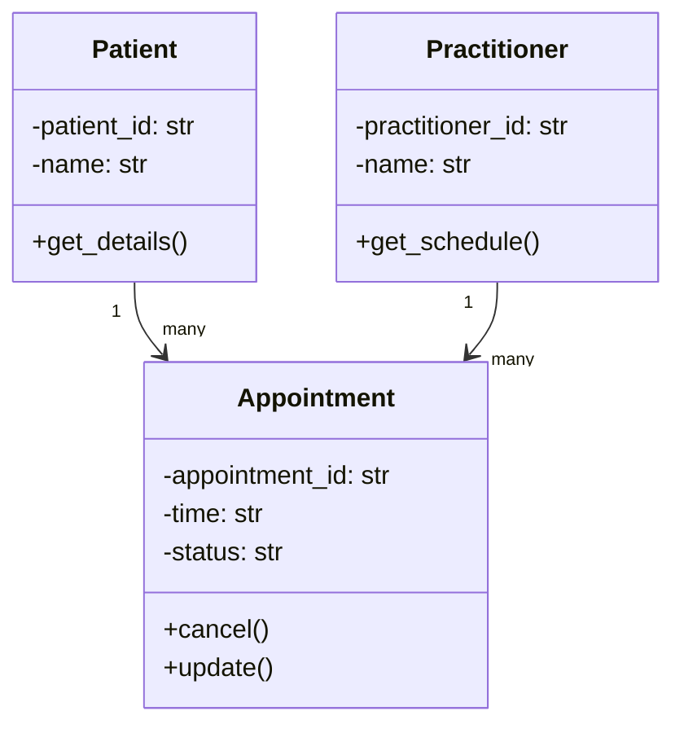

# SmartCare v0.3 - Domain Model Workbook

## Candidate Concepts

| Candidate | Class? | Reason |
| --- | --- | --- |
| Patient | Yes | Distinct entity with its own identity, data, and behaviour |
| Practitioner | Yes | Distinct entity with its own identity, data, and behaviour |
| Appointment | Yes | Represents a meaningful event linking Patient and Practitioner, with its own state |
| Name | No | Just an attribute of Patient/Practitioner, not an independent concept |
| Clinic | No (for v0.3) | Not required by any confirmed requirement; unnecessary top-level owner |
| Database | No | Infrastructure/technical concern, not a domain concept |
| Cancellation | No | An action/state change on Appointment, captured via its status attribute |
| Status | No | An attribute of Appointment, not a standalone class |

## Requirement-to-Concept Trace

| Requirement | Concept | State/behaviour | Decision |
| --- | --- | --- | --- |
| FR-01 | Patient | name, ID (state); create (behaviour) | Class |
| FR-02 | Patient | search fields | Class (search is behaviour on a collection) |
| FR-03 | Practitioner | name, ID | Class |
| FR-04 | Appointment | patient ref, practitioner ref, time | Class |
| FR-05 | Appointment | status/time-check logic | Behaviour on Appointment collection |
| FR-06 | Appointment | cancel() behaviour | Method on Appointment |
| FR-07 | Appointment | status = "cancelled" | State (status attribute) |
| FR-08 | Appointment | status attribute | State, not separate class |
| FR-09 | Practitioner/Appointment | view own appointments | Behaviour, filtering Appointments |
| FR-10 | Patient/Appointment | view history | Behaviour, filtering Appointments |
| FR-11 | Appointment | update() behaviour | Method on Appointment |
| FR-12 | Appointment (collection) | generate report | Behaviour on a collection/service |

## CRC Cards

### Patient

| Responsibilities | Collaborators |
| --- | --- |
| Store patient details (name, ID) | Appointment |
| Provide identifying info for search | - |

### Practitioner

| Responsibilities | Collaborators |
| --- | --- |
| Store practitioner details | Appointment |
| Report own scheduled appointments | Appointment |

### Appointment

| Responsibilities | Collaborators |
| --- | --- |
| Track date/time, status | Patient, Practitioner |
| Change status (booked/cancelled/completed) | - |

## UML Class Diagram

## Design Rationale

The domain model centers on three core classes: Patient, Practitioner, and
Appointment, directly traced from FR-01, FR-03, and FR-04. Name, status, and
cancellation were deliberately excluded as separate classes since they are
simple attributes or state changes rather than independent concepts with
their own identity and behaviour.

Appointment associates with both Patient and Practitioner rather than
inheriting from either, since an appointment "has a" patient and
practitioner, but is not "a type of" either. Both relationships are
one-to-many: a single Patient or Practitioner can be linked to multiple
Appointments, but each Appointment references exactly one of each.

AI-suggested manager classes (PatientManager, PractitionerManager) were
rejected because the requirements they cited only require a capability, not
a dedicated class - Patient and Practitioner can hold their own data without
a wrapper class. AppointmentManager was kept but scaled down to a lightweight
helper rather than a full class, since duplicate-booking checks (FR-05)
genuinely need to look across multiple appointments. ReportService was
accepted since reporting (FR-12) is a distinct responsibility from a single
Appointment.

## AI Design Review Record

| AI suggestion | Evidence | Decision | Reason | Model change |
| --- | --- | --- | --- | --- |
| Patient, Practitioner, Appointment | FR-01, FR-03, FR-04 | Accepted | Matches existing core model | None |
| PatientManager / PractitionerManager | FR-01, FR-02, FR-03, FR-09, FR-10 | Rejected | Conflates "capability needed" with "separate class needed" - adds unnecessary structure for a simple system | Not added |
| AppointmentManager | FR-04, FR-05, FR-06, FR-07, FR-08, FR-11 | Modified | Legitimate need for cross-appointment logic (duplicate checking), but kept lightweight rather than a full manager class | Added as a small helper module, not a formal class |
| ReportService | FR-12 | Accepted | Genuinely distinct responsibility from Appointment itself | Added as a simple reporting function |
| TimeSlot, StatusEnum, SearchService | FR-04, FR-05, FR-08, FR-02, FR-09 | Rejected | AI itself flagged these as unconfirmed; simple types (string, datetime) are sufficient at this stage | Not added |