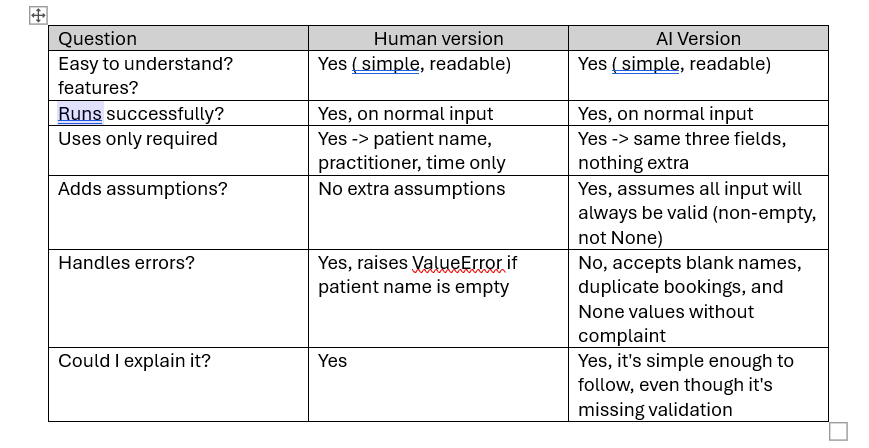
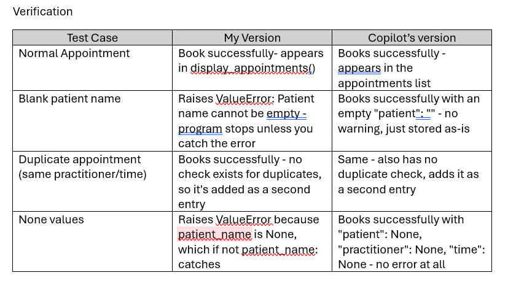

# Part G -> Chosen Improvement
The one controlled improvement I chose was adding input validation to
book_appointment():

    if not patient_name:
        raise ValueError("Patient name cannot be empty")

I chose this because the testing showed the AI-generated version accepted
blank and None patient names without warning, silently storing invalid data.